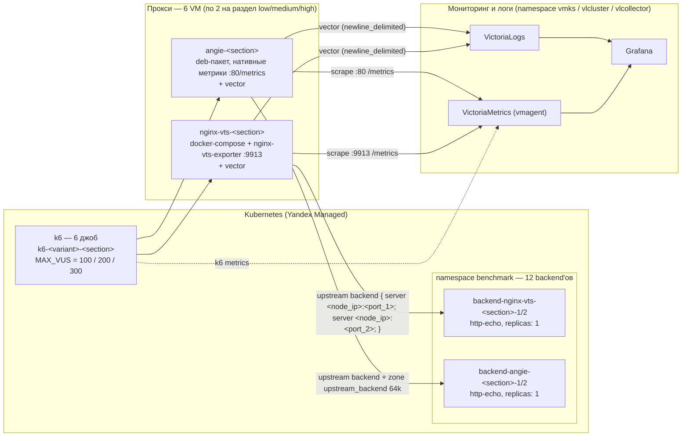

# Nginx-VTS vs Angie: бенчмарк производительности и функциональности

# протестировать несколько нод с angie proxy на получение letsencypt сертификат. 
Как angie будет синхронизировать сертификат между ними?

## Введение

Любой, кто эксплуатирует nginx в production, рано или поздно упирается в одну и ту же задачу — **нужны метрики**. Встроенный `stub_status` даёт лишь горстку счётчиков (активные соединения, принятые/обработанные запросы, чтение/запись/ожидание). Этого недостаточно: чтобы строить дашборды, настраивать алерты и разбираться в деградациях, нужны данные в разрезе server zone'ов, upstream'ов и кодов ответов.

Классическое решение — собрать nginx с модулем **VTS** (`nginx-module-vts`) и повесить рядом sidecar-экспортёр `nginx-vts-exporter`, который парсит JSON-статус и отдаёт метрики в формате Prometheus. Схема рабочая, но с издержками: модуль приходится собирать под конкретную версию nginx, экспортёр — отдельный процесс, который может упасть независимо от самого nginx, а любое обновление тянет за собой пересборку образа.

Вместо связки nginx + VTS можно взять **Angie** — форк nginx от «Веб-Сервера» с нативной поддержкой метрик Prometheus (`http_prometheus`). Здесь метрики отдаёт сам прокси, плюс REST API (`/api/`) и визуальная консоль Console Light — без сборки модулей и без sidecar-экспортёров.

Этот репозиторий — полностью воспроизводимый бенчмарк, который сравнивает оба подхода в равных условиях. Инфраструктура как код (Terraform) поднимает VM и Kubernetes-кластер, k6 генерирует одинаковую нагрузку, а VictoriaMetrics и Grafana собирают метрики и показывают результат на готовом дашборде: от развёртывания до дашборда — несколькими командами.

## Ключевые результаты

Бенчмарк разбит на **3 раздела** по уровню нагрузки и ресурсов VM. В каждом разделе ресурсы VM nginx-vts-docker и angie **одинаковые** — чтобы сравнивать прокси, а не железо. k6-сценарий один и тот же (warmup 10 VU × 30с + ramp 0→50→…→MAX_VUS→0 за 8м), меняется только пиковое значение VU (`MAX_VUS`).

| Раздел | MAX_VUS | Ресурсы VM (cores/RAM) | Сеть | Ожидаемое RPS |
|---|---|---|---|---|
| **Low**    | 100 | 2 c / 4 ГБ | software-accelerated | ~1500–2000 |
| **Medium** | 200 | 4 c / 8 ГБ | software-accelerated | ~3000–4000 |
| **High**   | 300 | 4 c / 8 ГБ | software-accelerated | ~4500–5500 |

> Конфигурация ресурсов и сети задаётся в `benchmark-vms.tf` (`local.benchmark_sections` — `cores`/`memory`/`max_vus`/`nodeport_*` на каждый раздел), пиковое VU передаётся в k6-job через env `MAX_VUS` в `benchmark/templates/k6-job.yaml.tftpl`. **Все 3 раздела запускаются одновременно**: 6 VM (2 на раздел) поднимаются одним `terraform apply`, 12 backend'ов и 6 k6-джоб применяются одной командой `kubectl apply`. Между разделами не нужно пересоздавать VM — каждый раздел имеет собственные VM и backend'ы. Подробная процедура — в шаге 5.

### Раздел 1: Low (100 VU, 2 c / 4 ГБ, software-accelerated network)

| Метрика | nginx-vts-docker | Angie |
|---------|------------------|-------|
| Всего запросов | _заполнить после прогона_ | _заполнить_ |
| Средняя latency | _заполнить_ | _заполнить_ |
| p95 latency | _заполнить_ | _заполнить_ |
| Ошибки (rate) | _заполнить_ | _заполнить_ |
| Макс. VU | 100 | 100 |

### Раздел 2: Medium (200 VU, 4 c / 8 ГБ, software-accelerated network)

| Метрика | nginx-vts-docker | Angie |
|---------|------------------|-------|
| Всего запросов | _заполнить_ | _заполнить_ |
| Средняя latency | _заполнить_ | _заполнить_ |
| p95 latency | _заполнить_ | _заполнить_ |
| Ошибки (rate) | _заполнить_ | _заполнить_ |
| Макс. VU | 200 | 200 |

### Раздел 3: High (300 VU, 4 c / 8 ГБ, software-accelerated network)

| Метрика | nginx-vts-docker | Angie |
|---------|------------------|-------|
| Всего запросов | 1,525,163 | 1,496,600 |
| Средняя latency (мс) | 28.98 | 30.03 |
| p95 latency (мс) | 100.74 | 110.32 |
| Max latency (мс) | 513.17 | 1506.91 |
| Ошибок | 0 | 0 |
| Макс. VU | 300 | 300 |

### Вывод

По результатам раздела High (300 VU, 4 c / 8 ГБ): nginx-vts-docker показал чуть лучшие результаты — на ~2% больше запросов (1,525,163 vs 1,496,600), на ~3.5% ниже средняя latency (28.98 мс vs 30.03 мс), на ~9% ниже p95 latency (100.74 мс vs 110.32 мс). Максимальная latency у nginx-vts-docker значительно ниже (513 мс vs 1507 мс). Оба варианта не допустили ни одной ошибки. Разница невелика — оба прокси хорошо справляются с нагрузкой 300 VU на 4 c / 8 ГБ.

## Архитектура



Бенчмарк поднимает **6 VM** (по 2 на раздел: `nginx-vts-<section>` + `angie-<section>`) и **12 backend'ов** (по 2 на каждую VM, NodePort 30085–30096: варианту `nginx-vts` отданы порты 30085–30090, варианту `angie` — 30091–30096) одним `terraform apply`. Каждый прокси балансирует на **2 отдельных бэкенда** через upstream (round-robin), свои для каждой VM: например `nginx-vts-low` → `backend-nginx-vts-low-1` (NodePort 30085) + `backend-nginx-vts-low-2` (NodePort 30086), а `angie-low` → `backend-angie-low-1` (NodePort 30091) + `backend-angie-low-2` (NodePort 30092). Бэкенды — отдельные Deployment+Service (по 1 поду `hashicorp/http-echo` каждый) в namespace `benchmark`. Разделение по разделам нужно, чтобы одновременный запуск 3 разделов не суммировал нагрузку на общих бэкендах, а в метриках upstream (`nginx_upstream_*`, `angie_http_upstreams_peers_*`) было видно 2 peer'а на прокси.

## Сравниваемые варианты

| Вариант | Описание | Метрики |
|---------|----------|---------|
| **nginx-vts-docker** | NGINX + VTS модуль в Docker Compose | nginx-vts-exporter (`:9913/metrics`), vector (`:9598`) |
| **angie** | Angie, нативная установка (deb-пакет) | **встроенный** Prometheus (`:80/metrics` через `prometheus_all.conf`), API (`/api/`), vector (`:9598`) |

## Отличительные features каждого варианта

Два варианта сопоставимы по производительности (см. «Ключевые результаты»), но принципиально различаются способом получения метрик, поставкой и наличием визуальной консоли.

### nginx-vts-docker

| Feature | Реализация |
|---|---|
| Базовый сервер | Голый **nginx 1.31.3** (mainline) из исходников (`nginx.org/download/nginx-1.31.3.tar.gz`), базовый образ `nginx:1.31.3-trixie` (Debian 13 trixie, PCRE2) |
| Модуль метрик | **Сторонний** `nginx-module-vts` v0.2.6 — собирается как dynamic-модуль (`--add-dynamic-module`) и подключается через `load_module` |
| Экспорт в Prometheus | **Внешний sidecar-экспортёр** `nginx-vts-exporter` v0.10.8 (отдельный Go-бинарник, слушает `:9913`), парсит JSON-статус с `http://127.0.0.1:80/status` |
| Поставка | **Docker Compose** — nginx собирается из Dockerfile, рядом контейнер vector; всё изолированно, но образ нужно собирать (`docker compose up -d --build`) |
| Endpoint статуса | `/status` — JSON (формат VTS) |
| Web-консоль | **Нет** — только JSON `/status` и текстовый `/stub_status` |
| Количество метрик | ~12 метрик `nginx_*` (server, upstream, cache) |
| Зависимости | Docker, git, build-essential, libpcre2-dev, zlib1g-dev, libssl-dev — для сборки модуля на VM |
| Обновление | Пересборка Docker-образа при выходе новой версии nginx/VTS-модуля |

> Ключевой недостаток — сторонний модуль VTS нужно собирать под каждую версию nginx, а экспортёр — отдельный процесс, который может упасть независимо от nginx. VTS v0.2.6 (июль 2026) [возобновил поддержку](https://github.com/vozlt/nginx-module-vts/releases/tag/v0.2.6): правки безопасности (buffer overflow, XSS), совместимость с nginx 1.30+, React-фронтенд статусной страницы.

### angie

| Feature | Реализация |
|---|---|
| Базовый сервер | **Angie** — форк nginx от «Веб-Сервера», устанавливается deb-пакетом из репозитория `download.angie.software` |
| Модуль метрик | **Нативный** `http_prometheus` — входит в поставку Angie, подключается одной строкой `include /etc/angie/prometheus_all.conf` |
| Экспорт в Prometheus | **Без отдельного экспортёра** — метрики отдаёт сам Angie на `:80/metrics` (`prometheus all;`), отдельный процесс не нужен |
| Поставка | **deb-пакет** (`apt-get install angie`) — без Docker, без сборки, без управления зависимостями компилятора |
| Endpoint статуса | `/api/` — REST API (`api /status/`, JSON-дерево `/status/connections/`, `/status/http/server_zones/`, `/status/http/upstreams/` и т.д.), `/metrics` — Prometheus, `/status.html` — `stub_status` |
| Web-консоль | **[Console Light](https://angie.software/angie/docs/configuration/monitoring/)** — отдельный пакет `angie-console-light`, ставится через `apt-get install angie-console-light`, отдаётся на `/console/` через `alias /usr/share/angie-console-light/html/`. В реальном времени показывает connections, server zones, upstreams, caches, SSL; в бенчмарке устанавливается в `cloud-init/angie.yaml` (доступна по `http://angie-console.<angie_ip>.sslip.io/console/`, URL выводится в `terraform output angie_console_url`) |
| Количество метрик | ~45 метрик `angie_*` (connections, server_zones, upstreams, slabs, caches и др.) «из коробки» |
| Сбор статистики | Через shared-memory зоны: `zone upstream_backend 64k` в `upstream` и `status_zone server_zone` в `server` — обязательны для сбора |
| Зависимости | Только deb-пакет angie + angie-console-light — всё из репозитория, без компиляции |
| Обновление | `apt-get upgrade angie angie-console-light` — обновление одной командой |

> Ключевое преимущество Angie — метрики «из коробки» (нативный Prometheus + REST API + визуальная Console Light) без сборки модулей и sidecar-экспортёров. Ключевое преимущество nginx-vts — независимость от форка (можно взять любой nginx и добавить модуль VTS).

## Метрики для сравнения

| Категория | Метрика | Источник |
|-----------|---------|----------|
| **Клиентские** | RPS, latency (p50/p95/p99), TTFB, ошибки | k6 |
| **Прокси** | request count, bytes sent/received, status codes, active connections | nginx-vts-exporter / нативные метрики Angie |
| **Ресурсы** | CPU, MEM прокси | node-exporter / cAdvisor |
| **Логи** | events/s, processed bytes | vector internal metrics |

## Структура файлов

| Файл | Описание |
|------|----------|
| `versions.tf` | Провайдеры Terraform (Yandex Cloud, Helm, Kubernetes) |
| `net.tf` | VPC-сеть и подсети |
| `ip-dns.tf` | Статический IP балансировщика (публичные имена через **sslip.io**, собственная DNS-зона не нужна) |
| `k8s.tf` | K8s-кластер, ноды, Helm-релиз Ingress, генерация values с IP |
| `variables.tf` | Переменные (параметры разделов заданы в `local.benchmark_sections` в `benchmark-vms.tf`) |
| `benchmark-vms.tf` | 6 VM (2 на раздел: `nginx-vts-<section>` + `angie-<section>`) через `for_each`, `local.benchmark_sections` — `max_vus`/`cores`/`memory`/`nodeport_*` |
| `benchmark-k8s.tf` | Namespace "benchmark", 12 бэкендов (по 2 на каждую VM, NodePort 30085–30096: nginx-vts 30085–30090, angie 30091–30096), ConfigMap с k6-скриптом и k6-env (6 IP) |
| `benchmark-runners.tf` | 6 k6 Job (по одной на variant×section со своим `MAX_VUS`) через `for_each` |
| `values/victoriametrics-values.yaml` | Helm values: VictoriaMetrics + Grafana + vmagent (генерируется, scrape всех 6 VM) |
| `values/victoria-logs-cluster-values.yaml` | Helm values: VictoriaLogs cluster + vlinsert ingress (генерируется) |
| `values/victoria-logs-collector-values.yaml` | Helm values: лог-коллектор |
| `values/*.tftpl` | Шаблоны values (рендерятся Terraform через `templatefile`) |
| `benchmark/templates/backend.yaml.tftpl` | Шаблон бэкенда (Deployment+Service, NodePort) — рендерится 12 раз: `backend-<variant>-<section>-1/2` |
| `benchmark/k6/benchmark.js` | k6 скрипт нагрузки |
| `benchmark/cloud-init/*.yaml` | cloud-init для каждой VM |
| `benchmark/configs/*.conf` | nginx/angie конфигурации |
| `benchmark/configs/vector-*.toml` | vector конфигурации |
| `benchmark/grafana/benchmark-dashboard.json` | Grafana dashboard |

## Порядок развёртывания

### 1. Инициализация и деплой

```bash
terraform init
terraform plan
terraform apply
```

### 2. Получение доступа к K8s

После успешного `terraform apply` получаем доступ к кластеру (ID кластера возьмите из вывода `terraform output -raw k8s_cluster_credentials_command` или из консоли Yandex Cloud):

```bash
yc managed-kubernetes cluster get-credentials --id <cluster-id> --external --force
kubectl get nodes
```

### 3. Установка мониторинга и логирования

Установите Helm-чарты (VictoriaMetrics, VictoriaLogs). Values-файлы уже сгенерированы Terraform с актуальными IP (включая sslip.io-хосты):

```bash
# Добавление Helm-репозитория
helm repo add victoriametrics https://victoriametrics.github.io/helm-charts/
helm repo update

# VictoriaMetrics (k8s-stack: vmoperator, vmagent, vmselect, vminsert, Grafana)
helm upgrade --install vmks \
  victoriametrics/victoria-metrics-k8s-stack \
  --version 0.90.1 \
  --namespace vmks --create-namespace \
  -f ./values/victoriametrics-values.yaml

# Версия victoria-metrics-k8s-stack 0.90.1 содержит исправление бага config-reloader'а
# VMAgent на Kubernetes 1.33 (issue https://github.com/VictoriaMetrics/helm-charts/issues/3136):
# ранее config-reloader не перечитывал Secret с конфигом скрейпов при пересоздании VM / смене IP,
# и без kubectl rollout restart deployment vmagent-vm-stack -n vmks скрейпы шли на устаревшие
# адреса. Начиная с 0.88.0 workaround не требуется.

# VictoriaLogs cluster
helm upgrade --install vlcluster \
  victoriametrics/victoria-logs-cluster \
  --version 0.2.8 \
  --namespace vlcluster --create-namespace \
  -f ./values/victoria-logs-cluster-values.yaml

# VictoriaLogs collector (сбор логов с подов)
helm upgrade --install vlcollector \
  victoriametrics/victoria-logs-collector \
  --version 0.3.7 \
  --namespace vlcollector --create-namespace \
  -f ./values/victoria-logs-collector-values.yaml
```

После установки `vmks` примените ConfigMap с Grafana-дашбордом (namespace `vmks` уже создан Helm'ом выше, файл сгенерирован Terraform):

```bash
kubectl apply -f benchmark/manifests/benchmark-dashboard-configmap.yaml
```

### 4. Применение benchmark-манифестов

Terraform рендерит 12 отдельных backend-манифестов (по одному на backend: `backend-<variant>-<section>-1/2.yaml`) из шаблона `benchmark/templates/backend.yaml.tftpl` — каждый содержит и Deployment, и Service. Команда также выводится в `terraform output kubectl_apply_benchmark_command`:

```bash
# Namespace, 12 backend'ов (Deployment+Service, NodePort 30085-30096), ConfigMap'ы с k6-скриптом и env (6 IP)
kubectl apply -f benchmark/manifests/namespace.yaml
kubectl apply -f benchmark/manifests/backend-nginx-vts-low-1.yaml -f benchmark/manifests/backend-nginx-vts-low-2.yaml \
  -f benchmark/manifests/backend-nginx-vts-medium-1.yaml -f benchmark/manifests/backend-nginx-vts-medium-2.yaml \
  -f benchmark/manifests/backend-nginx-vts-high-1.yaml -f benchmark/manifests/backend-nginx-vts-high-2.yaml \
  -f benchmark/manifests/backend-angie-low-1.yaml -f benchmark/manifests/backend-angie-low-2.yaml \
  -f benchmark/manifests/backend-angie-medium-1.yaml -f benchmark/manifests/backend-angie-medium-2.yaml \
  -f benchmark/manifests/backend-angie-high-1.yaml -f benchmark/manifests/backend-angie-high-2.yaml \
  -f benchmark/manifests/k6-script-configmap.yaml -f benchmark/manifests/k6-env-configmap.yaml
```

### 5. Запуск бенчмарка

Бенчмарк состоит из **3 разделов** (Low / Medium / High — см. «Ключевые результаты»). **Все 3 раздела запускаются одновременно**: Terraform поднимает 6 VM (2 на раздел: `nginx-vts-<section>` + `angie-<section>`), 12 backend'ов в K8s (по 2 на каждую VM, NodePort 30085–30096) и рендерит 6 k6-джоб (по одной на вариант×раздел со своим `MAX_VUS`). Каждый раздел имеет собственные VM и backend'ы, поэтому разделы не влияют друг на друга. Результаты каждого раздела заносятся в таблицу «Ключевые результаты».

#### Подготовка (один раз для всех 3 разделов)

Ресурсы VM, `MAX_VUS` и NodePort'ы заданы декларативно в `local.benchmark_sections` в `benchmark-vms.tf` — править файлы руками между разделами не нужно. Порты `nginx-vts` — базовые, порты `angie` — базовые + 6 (`local.nodeport_variant_offset`):

| Раздел | `max_vus` | `cores`/`memory` | `nodeport_1`/`nodeport_2` (nginx-vts) | `nodeport_1`/`nodeport_2` (angie) |
|---|---|---|---|---|
| `low`    | 100 | 2 / 4 | 30085 / 30086 | 30091 / 30092 |
| `medium` | 200 | 4 / 8 | 30087 / 30088 | 30093 / 30094 |
| `high`   | 300 | 4 / 8 | 30089 / 30090 | 30095 / 30096 |

1. Применить инфраструктуру и дождаться поднятия сервисов на всех 6 VM:

```bash
# Поднять 6 VM + сгенерировать манифесты (k6-env, scrape config, k6-job'ы с актуальными IP)
terraform apply -auto-approve

# Если у каких-то VM сменился публичный IP (ephemeral NAT): taint + re-apply (см. AGENTS.md)
# Затем повторно применить k6-env ConfigMap и vmagent scrape config с новыми IP:
kubectl apply -f ./benchmark/manifests/k6-env-configmap.yaml
helm upgrade vmks victoriametrics/victoria-metrics-k8s-stack --version 0.90.1 --namespace vmks \
  -f ./values/victoriametrics-values.yaml
kubectl rollout restart deployment vmagent-vm-stack -n vmks 2>/dev/null || true

# Дождаться завершения cloud-init на всех 6 VM (особенно 3× nginx-vts: docker build ~2-3 мин каждый)
# Проверить health сервисов на всех VM:
for name_ip in $(terraform output -json vm_all_ips | jq -r 'to_entries[] | "\(.key):\(.value)"'); do
  name="${name_ip%%:*}"; ip="${name_ip##*:}"
  variant="${name%%-*}"; section="${name##*-}"
  echo "=== $name ($ip) ==="
  echo -n "  HTTP: "; curl -s -m 10 -o /dev/null -w "%{http_code}\n" "http://$ip/"
  echo -n "  Vector: "; curl -s -m 10 -o /dev/null -w "%{http_code}\n" "http://$ip:9598/metrics"
  case "$variant" in
    nginx-vts)
      echo -n "  Metrics: "; curl -s -m 10 -o /dev/null -w "%{http_code}\n" "http://$ip:9913/metrics"
      echo -n "  Status: "; curl -s -m 10 -o /dev/null -w "%{http_code}\n" "http://$ip/status"
      ;;
    angie)
      echo -n "  Metrics: "; curl -s -m 10 -o /dev/null -w "%{http_code}\n" "http://$ip/metrics"
      echo -n "  API: "; curl -s -m 10 -o /dev/null -w "%{http_code}\n" "http://$ip/api/"
      ;;
  esac
done
```

#### Запуск всех 6 k6 jobs одновременно

```bash
# Удалить предыдущие джобы (если есть) и применить все 6 одной командой.
# Команда выводится в terraform output kubectl_apply_k6_jobs_command:
kubectl delete job -n benchmark -l app=k6 --ignore-not-found
kubectl apply -f benchmark/manifests/k6-angie-high-job.yaml -f benchmark/manifests/k6-angie-low-job.yaml \
  -f benchmark/manifests/k6-angie-medium-job.yaml -f benchmark/manifests/k6-nginx-vts-high-job.yaml \
  -f benchmark/manifests/k6-nginx-vts-low-job.yaml -f benchmark/manifests/k6-nginx-vts-medium-job.yaml
```

Дождаться завершения (~8м30с, все 6 джоб параллельно) и собрать результаты (см. шаг 6). Разделы не нужно повторять по отдельности — все 3 идут одновременно на собственных VM.

> **Важно:** ресурсы VM `nginx-vts-<section>` и `angie-<section>` **одинаковые** в рамках одного раздела — чтобы сравнивать прокси, а не железо. Между разделами ресурсы меняются ступенчато (low: 2c/4GB → medium/high: 4c/8GB), чтобы показать, как прокси масштабируются при росте ресурсов и нагрузки. Разделы изолированы физически (отдельные VM + отдельные backend'ы), поэтому одновременный запуск не искажает результаты.

### 6. Проверка результатов

```bash
# Статус k6 jobs (все 6: k6-nginx-vts-low/medium/high, k6-angie-low/medium/high)
kubectl get jobs -n benchmark
kubectl get pods -n benchmark -l app=k6

# Логи k6 (итоговая сводка в конце каждой джобы — JSON с variant, section, metrics)
for section in low medium high; do
  for variant in nginx-vts angie; do
    echo "=== $variant-$section ==="
    kubectl logs job/k6-$variant-$section -n benchmark
  done
done

# Проверка сервисов на всех 6 VM
# У каждого прокси свой порт метрик: nginx-vts отдаёт :9913/metrics (nginx-vts-exporter),
# angie — :80/metrics (нативный Prometheus). Endpoint метрик выбирается по имени варианта,
# а не через конструкцию `curl ... || curl ...` (она склеивает выводы обоих curl в строку вида "000200").
for name_ip in $(terraform output -json vm_all_ips | jq -r 'to_entries[] | "\(.key):\(.value)"'); do
  name="${name_ip%%:*}"; ip="${name_ip##*:}"
  variant="${name%%-*}"
  echo "=== $name ($ip) ==="
  echo -n "  HTTP: "; curl -s -m 10 -o /dev/null -w "%{http_code}\n" "http://$ip/" || echo "FAIL"
  echo -n "  Vector: "; curl -s -m 10 -o /dev/null -w "%{http_code}\n" "http://$ip:9598/metrics" || echo "N/A"
  case "$variant" in
    nginx-vts)
      echo -n "  Metrics: "; curl -s -m 10 -o /dev/null -w "%{http_code}\n" "http://$ip:9913/metrics" || echo "FAIL"
      echo -n "  Status: "; curl -s -m 10 -o /dev/null -w "%{http_code}\n" "http://$ip/status" || echo "FAIL"
      ;;
    angie)
      echo -n "  Metrics: "; curl -s -m 10 -o /dev/null -w "%{http_code}\n" "http://$ip/metrics" || echo "FAIL"
      echo -n "  API: "; curl -s -m 10 -o /dev/null -w "%{http_code}\n" "http://$ip/api/" || echo "FAIL"
      ;;
  esac
done

# Web-консоль Angie (Console Light) — открывается в браузере (ангie-high по умолчанию)
# (после terraform apply с обновлённым cloud-init; HTTP 200 + HTML отдаёт Console Light,
#  а не backend — последний отвечает "OK" на любой путь через location /)
ANGIE_IP=$(terraform output -raw vm_angie_ip)
curl -s -m 10 -o /dev/null -w "Angie Console Light: HTTP %{http_code}\n" "http://angie-console.$ANGIE_IP.sslip.io/console/"
echo "Открыть в браузере: http://angie-console.$ANGIE_IP.sslip.io/console/"

# SSH на любую VM (пользователь ubuntu). IP всех 6 VM:
terraform output vm_all_ips
ssh ubuntu@$(terraform output -raw vm_nginx_vts_docker_ip)   # nginx-vts-high
ssh ubuntu@$(terraform output -raw vm_angie_ip)              # angie-high
```

### 7. Доступ к мониторингу

Хосты формируются по схеме `<сервис>.<LB_IP>.sslip.io` (IP балансировщика из `terraform output` / `kubectl get svc -n ingress-nginx`):

- **Grafana**: `http://grafana.<LB_IP>.sslip.io` (например, http://grafana.89.169.132.222.sslip.io)
- **VictoriaMetrics**: `http://vmselect.<LB_IP>.sslip.io`
- **VictoriaLogs**: `http://victorialogs.<LB_IP>.sslip.io`
- **vlinsert**: `http://vlinsert.<LB_IP>.sslip.io`

URL Grafana, логин и команда для получения пароля выводятся в `terraform output` (пароль автогенерируется helm-чартом `vmks` на шаге 3, поэтому Terraform возвращает команду `kubectl`, а не сам пароль):

```bash
terraform output grafana_url
terraform output grafana_admin_user
terraform output grafana_admin_password_command    # команда для получения пароля из Secret vmks-grafana
```

> Логин: `admin`. Пароль — из Secret `vmks-grafana` (ключ `admin-password`), извлекается одной командой из `terraform output grafana_admin_password_command`.

### Готовый дашборд в Grafana

Дашборд **«Nginx-VTS vs Angie Benchmark»** (33 панели + 1 row-разделитель) применяется в Grafana через ConfigMap `benchmark-dashboard` (namespace `vmks`, лейбл `grafana_dashboard: "1"`, файл `benchmark/manifests/benchmark-dashboard-configmap.yaml`), который подхватывает sidecar `grafana-sc-dashboard` чарта `vmks`. Файл манифеста генерируется Terraform из шаблона `benchmark/templates/benchmark-dashboard-configmap.yaml.tftpl`; команда применения выводится в `terraform output kubectl_apply_dashboard_command` и продублирована на шаге 3. Ручной импорт через JSON не требуется.

Дашборд разбит на две секции:

1. **Сравнение (3 сводные панели)** — RPS по вариантам, входящий трафик (Bytes Received), исходящий трафик (Bytes Sent). Парные запросы nginx-vts и angie на одной панели для сопоставления.
2. **Парные метрики nginx-vts (слева) vs angie (справа) (1 row + 30 парных панелей = 15 пар)** — один общий row, в котором похожие метрики размещены рядом: nginx-vts всегда в левой колонке (`x: 0`), angie — в правой (`x: 12`), пары идут друг за другом по вертикали по темам: Connection states → Accepted/Handled → Server zone requests → HTTP responses by code → Server requestMsec → Cache status → Upstream responses by code → Upstream bytes → Upstream time/peer state → Shared zones/keepalive → Upstream health/selected → Slabs. Метрики без аналога (cache, upstream requestMsec — у nginx-vts; upstream keepalive/peer state/health/selected, slabs — у angie) помещены в тот же тематический row на свободной позиции с заголовком «(нет аналога …)» и пустым списком targets — для визуального параллелизма.

Дашборд использует метрики, которые scrape'ит vmagent (см. `values/victoriametrics-values.yaml.tftpl`, секция `extraObjects` → `vmks-additional-scrape-configs`):

- **nginx-vts-docker** (12 метрик `nginx_*`): `nginx_server_requests`, `nginx_server_bytes`, `nginx_server_connections`, `nginx_server_cache`, `nginx_server_requestMsec`, `nginx_server_sharedzones`, `nginx_upstream_bytes`, `nginx_upstream_requestMsec`, `nginx_upstream_requests`, `nginx_upstream_responseMsec`, `nginx_server_info`, `nginx_vts_exporter_build_info` — через `nginx-vts-exporter` на `:9913/metrics`.
- **angie** (26 метрик `angie_*`): `angie_connections_*` (4), `angie_http_server_zones_*` (6), `angie_http_upstreams_keepalive`, `angie_http_upstreams_peers_*` (8), `angie_slabs_*` (7) — нативный Prometheus на `:80/metrics`.

Datasource в Grafana — `VictoriaMetrics` (type `prometheus`, url `http://vmsingle-vm-stack.vmks.svc.cluster.local.:8428`), создаётся чартом автоматически. Откройте дашборд: Grafana → Dashboards → **Nginx-VTS vs Angie Benchmark** (папка `default`), либо напрямую по UID `nginx-vts-vs-angie-benchmark`:

```bash
echo "http://$(terraform output -raw grafana_url | sed 's|http://||')/d/nginx-vts-vs-angie-benchmark"
```

### Angie Console Light

Web-консоль Angie (визуальный мониторинг в реальном времени: connections, server zones, upstreams, caches, SSL) доступна по адресу, который выводится в `terraform output`:

```bash
terraform output angie_console_url
# http://angie-console.<angie_ip>.sslip.io/console/
```

Откройте URL в браузере (без аутентификации — `auth_basic` намеренно не включён, т.к. IP VM публичный только на время замера; для production добавьте `auth_basic`).

> sslip.io — бесплатный wildcard-DNS: `<anything>.<IP>.sslip.io` всегда резолвится в `<IP>`. Не требует делегирования доменной зоны.

## Метрики Angie «из коробки»

Angie собран с модулем `http_prometheus`. Для публикации метрик в конфиг добавлено:

```nginx
http {
    include /etc/angie/prometheus_all.conf;   # готовый шаблон "all"

    upstream backend {
        zone upstream_backend 64k;             # обязательно для сбора статистики upstream
        server <node_ip>:<port_1>;                 # backend-angie-<section>-1 (NodePort)
        server <node_ip>:<port_2>;                 # backend-angie-<section>-2 (NodePort)
        keepalive 64;
    }

    server {
        status_zone server_zone;               # обязательно для сбора статистики server
        ...
        location = /metrics { prometheus all; }  # нативный Prometheus endpoint
        location /api/    { api /status/; }      # REST API со статистикой
    }
}
```

Это даёт ~45 метрик `angie_*` (connections, server_zones, upstreams, slabs, caches и др.) без внешних экспортеров. vmagent scrape'ит `http://<angie_ip>/metrics`.

### Web-консоль Angie Console Light

Помимо API и метрик, Angie имеет визуальную консоль [Console Light](https://angie.software/angie/docs/configuration/monitoring/) — отдельный пакет `angie-console-light`, который в бенчмарке ставится через `apt-get install angie-console-light` в `cloud-init/angie.yaml`. Консоль отдаётся на `/console/`:

```nginx
location /console/ {
    auto_redirect on;
    alias /usr/share/angie-console-light/html/;
    index index.html;

    location /console/api/ {
        api /status/;
    }
}
```

Консоль доступна в браузере по `http://angie-console.<angie_ip>.sslip.io/console/` (URL выводится в `terraform output angie_console_url`; домен формируется через sslip.io из публичного IP VM Angie, `server_name _;` в конфиге принимает любой Host). Без аутентификации — в этом бенчмарке `auth_basic` намеренно не включён, т.к. IP VM публичный только на время замера; для production добавьте `auth_basic`. У nginx-vts аналога нет — только JSON `/status`.

## Особенности доставки логов (vector → VictoriaLogs)

В cloud-init vector отправляет логи в vlinsert по HTTP. Два важных момента, найденных при отладке:

1. **`framing.method = "newline_delimited"`** — без него vector сериализует батч как JSON-**массив** (`[{...},{...}]`), а VictoriaLogs `/insert/jsonline` ожидает **по одному объекту на строку**. Иначе — `400 Bad Request` с ошибкой `value doesn't contain object; it contains array`.
2. **Корректный query-string** — параметры разделяются `&`, а не запятой: `?_stream_fields=instance&_msg_field=msg&_time_field=ts`.
3. **`batch.max_bytes`** — ограничение размера батча (~900KB) предотвращает `413 Payload Too Large` при всплеске логов под нагрузкой.

Remap-трансформы добавляют поле `instance` (stream label) и человекочитаемый `msg` (`METHOD URI STATUS`), поэтому в VictoriaLogs логи удобно фильтровать по `_stream:{instance="angie"}`.

## Особенность сборки nginx-vts-docker (Docker Hub mirror + fallback apt-зеркала)

cloud-init VM `nginx-vts-docker` собирает образ `nginx:1.31.3-trixie` и тянет `timberio/vector:0.57.0-debian` с Docker Hub. Иногда `production.cloudfront.docker.com` (CDN Docker Hub) отдаёт `i/o timeout` из сети Yandex Cloud — cloud-init падает на `docker compose up`, и сервисы на VM не поднимаются. Чтобы этого избежать, в `benchmark/cloud-init/nginx-vts-docker.yaml`:

1. **`/etc/docker/daemon.json`** с `"registry-mirrors": ["https://mirror.gcr.io"]` — Docker тянет образы через публичный mirror `mirror.gcr.io` (Google), который стабильно доступен из Yandex Cloud и кэширует Docker Hub.
2. **Retry `docker pull`** для `timberio/vector:0.57.0-debian` и `nginx:1.31.3-trixie` (5 попыток с паузой 10с) + повторный `docker compose up --build`, если первый запуск не поднял контейнер `nginx-vts`.
3. **Fallback apt-репозитория Docker** — `runcmd` сначала пробует зеркало `mirror.yandex.ru/mirrors/download.docker.com` (быстрее из сети Yandex Cloud), а если `apt-get install docker-ce` падает (яндексовское зеркало периодически рассинхронизируется: размер `Packages.bz2` не совпадает, `Package 'docker-ce' has no installation candidate`), переключается на прямой `download.docker.com` и повторяет установку. Без этого fallback cloud-init завершается с `status: error`, docker не установлен, сервисы не поднимаются.

Проверено из VM Yandex Cloud: `mirror.gcr.io/v2/timberio/vector/manifests/0.57.0-debian` → `HTTP 200` (тогда как прямой `registry-1.docker.io` периодически таймаутит). Прямой `download.docker.com/linux/ubuntu/dists/jammy/stable/binary-amd64/Packages.bz2` → `HTTP 200` с корректным размером (тогда как `mirror.yandex.ru` в моменты синхронизации отдаёт неверный размер).

## Конфигурация ресурсов и сети VM/K8s

Бенчмарк состоит из **3 разделов** с разными ресурсами VM и сетью (см. «Ключевые результаты»). Все 3 раздела **запускаются одновременно** — каждый раздел имеет собственные VM и backend'ы, Terraform поднимает их всех одним `apply`. Конкретная конфигурация для каждого раздела задана в `local.benchmark_sections` в `benchmark-vms.tf` (`cores`/`memory`/`max_vus`/`nodeport_*`). Ресурсы VM `nginx-vts-<section>` и `angie-<section>` **всегда одинаковые** в рамках одного раздела — чтобы сравнивать прокси, а не железо.

Сводка по всем разделам (6 VM + 12 backend'ов поднимаются одновременно):

| Раздел | K8s node group | VM nginx-vts-\<section\> | VM angie-\<section\> | NodePort'ы nginx-vts (2 backend'а) | NodePort'ы angie (2 backend'а) | Сеть VM |
|---|---|---|---|---|---|---|
| **Low**    | 4 c / 8 ГБ, preemptible | 2 c / 4 ГБ, preemptible | 2 c / 4 ГБ, preemptible | 30085 / 30086 | 30091 / 30092 | software-accelerated |
| **Medium** | 4 c / 8 ГБ, preemptible | 4 c / 8 ГБ, preemptible | 4 c / 8 ГБ, preemptible | 30087 / 30088 | 30093 / 30094 | software-accelerated |
| **High**   | 4 c / 8 ГБ, preemptible | 4 c / 8 ГБ, preemptible | 4 c / 8 ГБ, preemptible | 30089 / 30090 | 30095 / 30096 | software-accelerated |

Все инстансы — платформа `standard-v2`, **preemptible** (`scheduling_policy.preemptible = true`), сеть **software-accelerated** (`network_acceleration_type = "software_accelerated"`). K8s node group во всех разделах: 4 c / 8 ГБ (не меняется, т.к. нагрузка от k6 идёт через K8s).

`software_accelerated` — ускоренная сеть Yandex Cloud (без GPU, доступно на `standard-v2`): снижает overhead на сетевом I/O. Включается в `k8s.tf` (`instance_template.network_acceleration_type`) и `benchmark-vms.tf` (верхнеуровневое поле `network_acceleration_type` ресурса `yandex_compute_instance`).

> ⚠️ При изменении ресурсов/ускоренной сети Terraform останавливает VM (`allow_stopping_for_update = true`), а Yandex Compute **освобождает ephemeral NAT IP** на stop — после stop/start SSH/HTTP по старому публичному IP перестают отвечать. Процедура восстановления (taint VM → re-apply → обновить k6-env ConfigMap → helm upgrade vmks → restart vmagent) описана в `AGENTS.md`.

## k6 сценарий нагрузки

k6-скрипт (`benchmark/k6/benchmark.js`) параметризован через env-переменные `MAX_VUS` (пиковое значение VU), `SECTION` (раздел: low/medium/high), `VARIANT` (nginx-vts/angie), `TARGET` (IP VM). Один и тот же сценарий для всех 3 разделов — меняется только `MAX_VUS` (100 / 200 / 300), которое передаётся из `local.benchmark_sections[section].max_vus` через k6-job шаблон. Длительность ступенек (`STAGE_HOLD`) также параметризована (по умолчанию 120с):

1. **Warmup**: 10 VU × 30 сек
2. **Ramp-up**: 0 → 50 VU за 30 сек
3. **Sustained**: 50 VU × `STAGE_HOLD` сек
4. **Peak ramp**: 50 → `MAX_VUS` × 0.5 за 30 сек
5. **Peak sustained (mid)**: `MAX_VUS` × 0.5 × `STAGE_HOLD` сек
6. **High peak ramp**: `MAX_VUS` × 0.5 → `MAX_VUS` за 30 сек
7. **High peak sustained**: `MAX_VUS` × `STAGE_HOLD` сек
8. **Cooldown**: `MAX_VUS` → 0 за 30 сек

При `MAX_VUS=300` промежуточная ступень = 150. Значения `MAX_VUS`/`SECTION`/`VARIANT`/`TARGET` передаются в k6 job через env (см. `benchmark/templates/k6-job.yaml.tftpl`); `MAX_VUS` берётся из `local.benchmark_sections[section].max_vus` в `benchmark-vms.tf`. Общая длительность — 8м30с (30с warmup + 8м load при `STAGE_HOLD=120`). Все 6 k6-джоб стартуют одновременно и пишут summary в `/tmp/k6-summary-<variant>-<section>.json` (а также в stdout — `kubectl logs`).

> **Требования к памяти k6:** при `MAX_VUS=300` k6 потребляет до ~1 ГБ RAM. Шаблон `k6-job.yaml.tftpl` задаёт лимит 2Gi. При уменьшении лимита до 512Mi k6 падает с `OOMKilled` после ~8 минут работы (см. `ERRORS.md`).

## Соответствие метрик nginx-vts и angie

Таблица маппинга похожих метрик nginx-vts-docker (`nginx_*`, 12 метрик через `nginx-vts-exporter` на `:9913/metrics`) и angie (`angie_*`, 26 метрик через нативный Prometheus на `:80/metrics`). Метрики сгруппированы по темам; в каждой строке слева — метрика nginx-vts, справа — похожая метрика angie. Строки, где аналог отсутствует, помечены «—» в соответствующей колонке. Эта таблица — источник парных панелей в дашборде Grafana (см. «Готовый дашборд в Grafana»).

### Connections

| Тема | nginx-vts (метрика, лейблы) | angie (метрика, лейблы) | Тип | Примечание |
|---|---|---|---|---|
| Active connections | `nginx_server_connections{status="active"}` | `angie_connections_active` | gauge | текущие активные соединения |
| Reading | `nginx_server_connections{status="reading"}` | — | gauge | Angie не разделяет неактивные соединения по состояниям |
| Writing | `nginx_server_connections{status="writing"}` | — | gauge | то же |
| Waiting | `nginx_server_connections{status="waiting"}` | — | gauge | то же |
| Idle connections | — | `angie_connections_idle` | gauge | суммарные простаивающие; у nginx-vts аналога нет (раскладывается на reading/writing/waiting) |
| Accepted connections | `nginx_server_connections{status="accepted"}` (rate) | `angie_connections_accepted` (rate) | counter | принято соединений |
| Handled connections | `nginx_server_connections{status="handled"}` (rate) | — | counter | Angie не экспортирует handled отдельно (handled = accepted при drop=0) |
| Dropped connections | — | `angie_connections_dropped` (rate) | counter | сброшенные соединения; nginx-vts не экспортирует dropped (можно вычислить как accepted − handled) |
| Total requests (connection-level) | `nginx_server_connections{status="requests"}` (rate) | — | counter | суммарные запросы на уровне соединений; у angie учитывается в server_zones (`angie_http_server_zones_requests_total`) |

### Server zone / HTTP

| Тема | nginx-vts (метрика, лейблы) | angie (метрика, лейблы) | Тип | Примечание |
|---|---|---|---|---|
| Server zone requests total | `nginx_server_requests{code="total"}` (rate) | `angie_http_server_zones_requests_total` (rate) | counter | суммарные запросы в server zone |
| Requests processing | — | `angie_http_server_zones_requests_processing` | gauge | запросы в обработке; nginx-vts аналога не имеет |
| Requests discarded | — | `angie_http_server_zones_requests_discarded` (rate) | counter | отброшенные запросы; nginx-vts аналога не имеет |
| HTTP responses by code | `nginx_server_requests{code!~"total"}` (rate by `code`) | `angie_http_server_zones_responses` (rate by `code`) | counter | 1xx/2xx/3xx/4xx/5xx |
| Bytes received (in) | `nginx_server_bytes{direction="in"}` (rate) | `angie_http_server_zones_data_received` (rate) | counter | входящий трафик server zone |
| Bytes sent (out) | `nginx_server_bytes{direction="out"}` (rate) | `angie_http_server_zones_data_sent` (rate) | counter | исходящий трафик server zone |
| Server request processing time | `nginx_server_requestMsec` (avg) | — | gauge (avg) | среднее время обработки запроса, мс; angie не экспортирует per-request processing time в server zone |
| Cache status | `nginx_server_cache` (rate by `status`) | — | counter | hit/miss/bypass/expired/revalidated/scarce/stale/updating; в бенчмарке angie не настроен с кэшем |

### Upstream

| Тема | nginx-vts (метрика, лейблы) | angie (метрика, лейблы) | Тип | Примечание |
|---|---|---|---|---|
| Upstream responses by code | `nginx_upstream_requests` (rate by `code`) | `angie_http_upstreams_peers_responses` (rate by `code`) | counter | ответы upstream по кодам |
| Upstream bytes in | `nginx_upstream_bytes{direction="in"}` (rate) | `angie_http_upstreams_peers_data_received` (rate) | counter | байты от upstream (in) |
| Upstream bytes out | `nginx_upstream_bytes{direction="out"}` (rate) | `angie_http_upstreams_peers_data_sent` (rate) | counter | байты к upstream (out) |
| Upstream request time | `nginx_upstream_requestMsec` (avg) | — | gauge (avg) | время запроса к upstream, мс; angie аналога не имеет |
| Upstream response time | `nginx_upstream_responseMsec` (avg) | — | gauge (avg) | время ответа от upstream, мс; angie аналога не имеет |
| Upstream keepalive | — | `angie_http_upstreams_keepalive` | gauge | текущие keepalive-соединения к upstream; nginx-vts не экспортирует |
| Upstream peer state | — | `angie_http_upstreams_peers_state` (by `peer`) | gauge | состояние peer'а (0=up); nginx-vts не экспортирует |
| Upstream peer health: fails | — | `angie_http_upstreams_peers_health_fails` (rate) | counter | неудачи peer'а; nginx-vts не экспортирует |
| Upstream peer health: unavailable | — | `angie_http_upstreams_peers_health_unavailable` (rate) | counter | недоступность peer'а; nginx-vts не экспортирует |
| Upstream peer health: downtime | — | `angie_http_upstreams_peers_health_downtime` | gauge | суммарное время простоя peer'а, с; nginx-vts не экспортирует |
| Upstream peer selected: current | — | `angie_http_upstreams_peers_selected_current` | gauge | текущие выбранные peer'ы; nginx-vts не экспортирует |
| Upstream peer selected: total | — | `angie_http_upstreams_peers_selected_total` (rate) | counter | всего выбраний peer'а; nginx-vts не экспортирует |

### Shared memory / Slabs

| Тема | nginx-vts (метрика, лейблы) | angie (метрика, лейблы) | Тип | Примечание |
|---|---|---|---|---|
| Shared zone usedsize | `nginx_server_sharedzones{memstat="usedsize"}` | — | gauge | занято в зоне `ngx_http_vhost_traffic_status`; angie не экспортирует usedsize для этой зоны |
| Shared zone maxsize | `nginx_server_sharedzones{memstat="maxsize"}` | — | gauge | лимит зоны `ngx_http_vhost_traffic_status`; angie не экспортирует maxsize для этой зоны |
| Slabs pages free | — | `angie_slabs_pages_free` | gauge | свободные страницы slab-зоны `upstream_backend`; nginx-vts не экспортирует slabs |
| Slabs pages used | — | `angie_slabs_pages_used` | gauge | занятые страницы slab-зоны; nginx-vts не экспортирует |
| Slabs slots used | — | `angie_slabs_pages_slots_used` (by `size`) | gauge | занятые слоты по размеру; nginx-vts не экспортирует |
| Slabs slots free | — | `angie_slabs_pages_slots_free` (by `size`) | gauge | свободные слоты по размеру; nginx-vts не экспортирует |
| Slabs slots reqs | — | `angie_slabs_pages_slots_reqs` (rate by `size`) | counter | запросы выделения слотов; nginx-vts не экспортирует |
| Slabs slots fails | — | `angie_slabs_pages_slots_fails` (rate by `size`) | counter | неудачи выделения слотов; nginx-vts не экспортирует |

### Прочие метрики без пары

| Метрика | Источник | Тип | Примечание |
|---|---|---|---|
| `nginx_server_info` | nginx-vts | info | метаданные сервера (`Info`-тип, значение 1) |
| `nginx_vts_exporter_build_info` | nginx-vts-exporter | info | версия экспортёра (`Info`-тип, значение 1) |

## Очистка

```bash
terraform destroy
```
